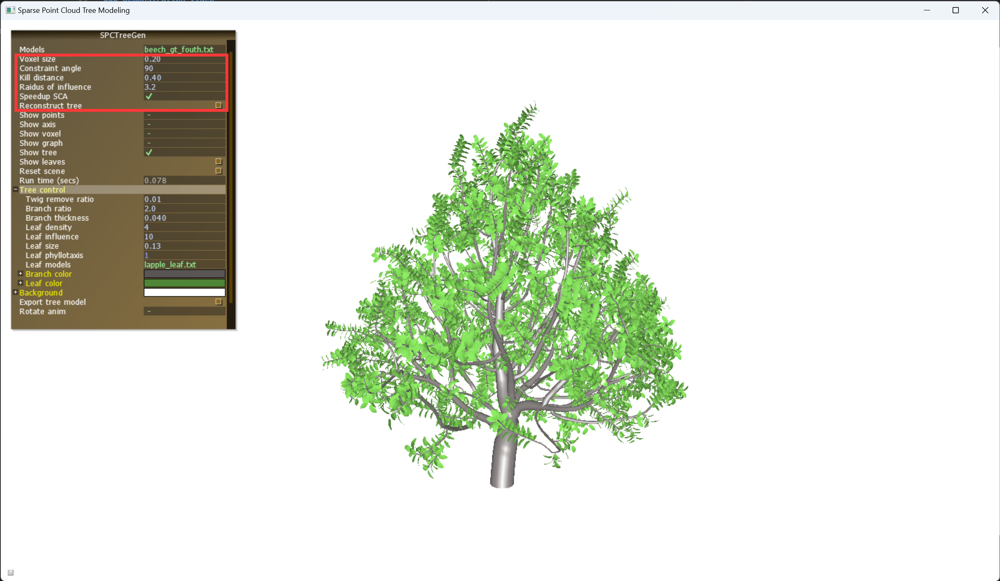

# 3D Reconstruction Software of Tree Point Clouds 

## 3D Reconstruction of Tree Point Clouds

In the 3D tree reconstruction software based on ALS point clouds, after selecting the input point cloud data, users can set different parameter values in the parameter bar to control the growth angle of the trunk, the density of branches, the smoothness of branches, etc. Different colors can be selected for the trunk and leaves. The software comes with different leaf models for users to choose from, and by adjusting parameters, the tree model can be made more realistic. The following is a demonstration of the software usage process.

**Step 1:** Open the `Software` folder, double-click the executable program `3DTreeModelGen.exe`, select the exported tree point cloud file after the Models section, and reconstruct the model. The software can control the pitch angle with 'W', 'A' keys, the left and right rotation with 'S', 'D' keys, the left and right tilt angle with 'Q', 'E' keys, and zoom with 'Z', 'X' keys.

<b>Figure 1</b> Selecting the tree point cloud to be reconstructed

**Step 2:**

1. Set different parameter values in the red box in Figure 2 to control the growth of the trunk, and click Reconstruct tree to reconstruct the tree (Figure 2).

<b>Figure 2</b> Demonstration of the tree point cloud reconstruction process

2. In the Tree control column, manually adjust parameters such as the thickness of the branch model and the size and density of the leaves to make the model more realistic (Figure 3).

<b>Figure 3</b> Demonstration of tree point cloud reconstruction effect (adjusting branches and leaves parameters)

3. In the Leaf models sub-column of Tree control, select different leaf models to give the reconstructed tree model different styles. Figure 4 shows the reconstruction effect corresponding to the maple leaf model.

<b>Figure 4</b> Demonstration of tree point cloud reconstruction effect (using maple leaf model)

